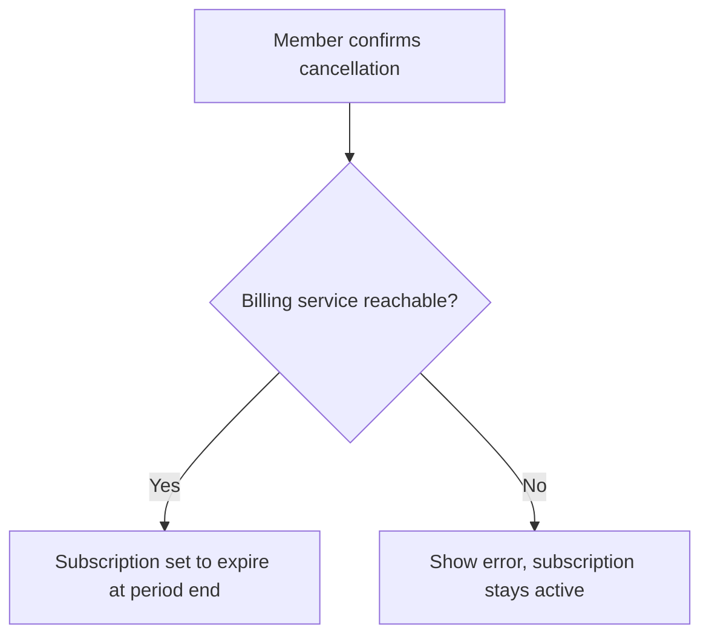
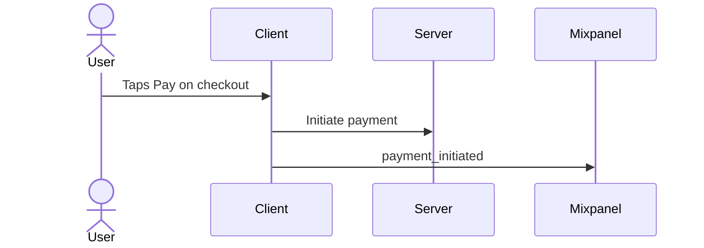

# Diagram Rules — Mermaid in the PRD

The skill can add **Mermaid diagrams** inline in the PRD so a reader sees a flow or an
interaction next to the prose that describes it. This file is the full spec. Load it whenever
a diagram is offered (Mode 1) or requested (Mode 3).

A diagram is a **re-rendering of content the user already confirmed**. It is never a source of
new facts. Everything in the Anti-Hallucination Rules (SKILL.md) applies to diagrams without
exception.

---

## Supported types and where they go

Only two diagram types are supported. Do not emit any other type (no state, ER, gantt, class, or
journey diagrams).

| Type | Mermaid header | Home section | Built from |
|---|---|---|---|
| Flowchart / user flow | `flowchart TD` (or `LR`) | §8 Requirements | a user story's confirmed Gherkin happy + edge scenarios |
| Flowchart / user flow | `flowchart TD` (or `LR`) | §9 Solution | the confirmed proposed-approach / user flow |
| Sequence diagram | `sequenceDiagram` | §9 Solution | a confirmed multi-system / API interaction in the approach |
| Sequence diagram | `sequenceDiagram` | §11 Event & Data Tracking | a confirmed event row (actor → client → server → destination) |

Place the diagram inline, directly under the prose or table it depicts — never in a separate
diagrams section.

---

## The derive-from-confirmed-content rule

This is the load-bearing rule. It is not optional.

- **Every node, edge, actor, and message must trace to something the user confirmed** in the
  section the diagram lives in. If the user did not say it, it is not in the diagram.
- **Never invent** a decision branch, an intermediate step, a system, a service, an actor, or a
  destination to make a diagram look complete. A thinner diagram that is fully sourced beats a
  richer one that guesses.
- If a step in the flow is genuinely unknown, label that node `[TBD]` — exactly as the prose
  rules require. Do not silently drop it and do not fabricate a plausible step in its place.
- A diagram **adds structure, it does not add content**. If the section content is a flat list
  with no flow, branching, or interaction, do not offer a diagram — it would only be decoration.
- The diagram and the prose must agree. If you cannot draw the diagram without contradicting or
  going beyond the confirmed text, stop and ask the user instead of inventing.

---

## Propose, then confirm (verify-before-write)

Diagrams are never auto-written. They follow the same verify-before-write mechanic as sourced
facts:

1. **Offer.** At a natural point (see the interview-questions touchpoints for §8, §9, §11), offer
   a relevant diagram with a 2-option `AskUserQuestion` (Yes, add it / No, skip).
2. **Draft from confirmed content only.** Build the Mermaid using terms the user already gave —
   role names, actions, system names, event names, destinations — verbatim where possible.
3. **Show the source + a one-line description.** Display the raw ` ```mermaid ` block and one
   plain-language sentence of what it depicts. For example:
   > "Here is a sequence diagram of the `payment_initiated` event path: the user taps Pay, the
   > client sends the charge to the server, the server calls the processor and writes the event to
   > Mixpanel. OK to write this to §11, or want to adjust?"
4. **Write only after a yes.** If the user wants changes, revise and show again. Never write a
   diagram the user has not seen and approved.

---

## Mermaid conventions

- Fence every diagram as a ` ```mermaid ` code block so it renders on GitHub and most markdown
  viewers.
- Start with an explicit header keyword: `flowchart TD` (top-down) or `flowchart LR`
  (left-right) for flows, `sequenceDiagram` for sequences.
- Draw node, actor, and message labels from the confirmed terms. Use the user's wording, not a
  paraphrase.
- Keep diagrams **unstyled and readable**: no `classDef`, no theme directives, no color or CSS.
  Portability and reviewability come first.
- One concept per diagram. If a flow has two distinct sub-flows, offer two diagrams rather than
  one tangled graph.
- Keep it small. A PRD diagram is an aid, not an architecture spec — aim for roughly 5 to 12
  nodes or messages. If it needs more, the underlying content probably belongs in a linked design
  doc.

---

## Worked example — flowchart from Gherkin (§8)

Confirmed story US-014 with two scenarios:

```gherkin
Scenario: Member cancels with a saved payment method
  Given a member with an active subscription
  When they confirm cancellation
  Then the subscription is set to expire at period end

Scenario: Cancellation fails because billing is unreachable
  Given a member with an active subscription
  When they confirm cancellation and the billing service times out
  Then an error is shown and the subscription stays active
```

Derived flowchart (every node maps to a Given/When/Then above):



Note: the decision node `Billing service reachable?` is allowed only because the second scenario
confirms that branch. Without it, the diagram would be a straight line.

---

## Worked example — sequence diagram from an event row (§11)

Confirmed §11 row:

| Event Name | Trigger Condition | Side | Destination | Maps to Metric |
|---|---|---|---|---|
| `payment_initiated` | User taps Pay on checkout | Client | Mixpanel | Checkout conversion |

Derived sequence diagram (actors and messages all come from the row):



Note: `Server` appears only because the confirmed approach in §9 says the client calls the
server. If the event were purely client-side with no server hop, the `Server` participant would
not appear.

---

## What NOT to do

- Do not invent a decision branch the scenarios do not contain.
- Do not add a system, service, or destination the user never named.
- Do not draw a diagram for content that is a flat list with no flow or interaction.
- Do not style, theme, or color diagrams.
- Do not write a diagram before showing it and getting a yes.
- Do not let a diagram assert something the prose does not — they must always agree.
